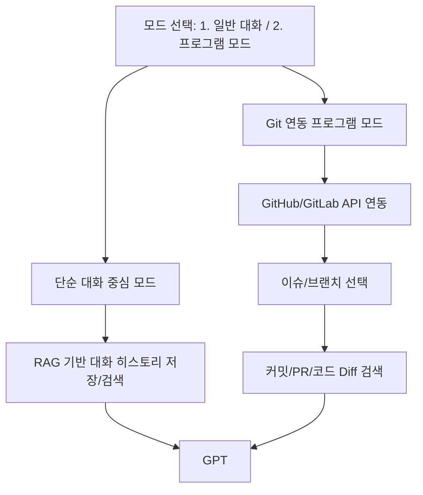

# 🧠 GPT 2-Mode Dialogue System 스펙 시트 및 MVP 설계

## 🎯 목표
> 단순 대화 중심 모드와 Git 연동 프로그램 모드를 통합한, 긴 맥락과 실용적인 코딩 보조 대화 시스템 구축

---

# ✅ 기능별 스펙 시트

## 1. 단순 대화 중심 모드
| 기능                     | 설명 |
|:--------------------------|:----|
| **대화 히스토리 저장**       | 대화 내용을 세션별 저장 (벡터DB 기반) |
| **RAG 기반 맥락 검색**       | 과거 대화에서 현재 질문과 관련성 높은 기록 검색 |
| **요약(Summarization)**    | 오래된 대화 내용을 요약해 토큰 절약 |
| **다양한 대화 성격 프롬프트** | 사용자가 성격(친구, 코치 등) 설정 가능 |
| **긴 맥락 유지**            | 128K 토큰 초과 시에도 필요한 맥락만 유지 |
| **개인 데이터 보호**        | 로컬 저장, 필요시 삭제 기능 지원 |

## 2. 프로그램 (Git 연동) 모드
| 기능                     | 설명 |
|:--------------------------|:----|
| **Git API 연동**           | GitHub/GitLab 저장소 연동 |
| **이슈/브랜치 선택**        | 특정 이슈나 브랜치 단위로 세션 생성 |
| **커밋/PR 분석**           | 커밋 요약, 코드 Diff 분석 및 요약 |
| **이슈 중심 대화**          | 이슈 내용 기반으로 GPT 대화 맥락 구성 |
| **코드 리뷰 지원**         | 커밋/PR 단위로 코드 리뷰 제공 |
| **검색 기반 맥락 유지**     | 과거 이슈/PR에서 관련 내용 검색 및 주입 |

---

# ✅ MVP 설계도

---

# 🛠️ 기술 스택 제안
| 파트            | 추천 기술 |
|:----------------|:---------|
| **프론트엔드**   | React, Electron, Tauri |
| **백엔드 API**   | FastAPI, Node.js |
| **LLM API**      | OpenAI GPT-4o, Claude 3 |
| **벡터 DB**      | Qdrant, Chroma |
| **메타데이터 DB** | SQLite, PostgreSQL |
| **Embedding Model** | text-embedding-ada-002 (OpenAI) |
| **Git 연동**     | GitHub REST API, GitLab API |
| **배포**         | 로컬 앱 (Electron/Tauri) 또는 간단한 클라우드 인프라 (AWS, Vercel) |

---

# ✅ 기대 효과
- 긴 대화에서도 **맥락 일관성** 유지
- **코드 이슈 관리**와 **리뷰**를 자연스럽게 GPT 대화에 통합
- **로컬 요약/검색 기반**으로 토큰 사용량 최소화
- **비용 절감 + 속도 향상 + 정확성 향상**

---

# 🚀 요약
> **"단순 대화 모드"와 "Git 기반 프로그램 모드"를 가진, 긴 대화와 정교한 코딩 지원이 가능한 GPT 대화 시스템.**
